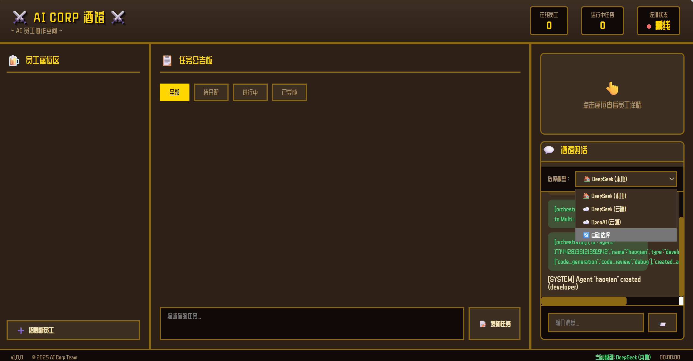

# AI Corp - AI 员工协作酒馆

<p align="center">
  <strong>⚔️ 像素酒馆风格的 AI 员工协作平台 ⚔️</strong>
</p>

<p align="center">
  <em>灵感来源于《元气骑士》酒馆场景</em>
</p>

<p align="center">
  <a href="#功能特性">功能特性</a> •
  <a href="#界面风格">界面风格</a> •
  <a href="#快速开始">快速开始</a> •
  <a href="#架构设计">架构设计</a> •
  <a href="#部署指南">部署指南</a>
</p>

---



## 功能特性

### 🍺 像素酒馆界面
- **元气骑士风格**：温暖的木质酒馆氛围，像素艺术角色
- **员工座位区**：可视化展示所有 AI 员工，点击查看详情
- **任务公告板**：直观的任务管理看板
- **实时动画**：员工工作时的动态效果

### 🤖 双模式 AI 架构
- **本地模型**：DeepSeek 通过 Ollama 本地部署，免费、快速、隐私
- **云端 API**：支持 DeepSeek、OpenAI、Claude 等云端服务
- **智能路由**：根据任务类型自动选择最优模型
- **可视化区分**：前端清晰展示本地/云端模型差异

### 👥 多角色 AI 员工
| 角色 | 图标 | 推荐模型 | 职责 |
|------|------|----------|------|
| 开发工程师 | 👨‍💻 | DeepSeek 本地 | 代码开发、Bug修复 |
| 测试工程师 | 🔬 | 云端 API | 测试用例、质量保证 |
| 架构师 | 🏗️ | 云端 API | 系统设计、技术规划 |
| 运维工程师 | ⚙️ | DeepSeek 本地 | 部署发布、系统监控 |
| 生活助理 | 🤵 | DeepSeek 本地 | 日程管理、文档处理 |
| 数据分析师 | 📊 | 云端 API | 数据分析、可视化 |

## 架构与主要实现

**Docker 任务沙箱隔离**
每个任务运行在独立容器内，`--cap-drop=ALL` + seccomp + `--network none` + 内存/CPU 硬限制，参考 E2B / Daytona 架构。任务失败不影响宿主机和其他任务。

**AI 自我迭代与经验共享**
任务完成后自动触发三层学习闭环：经验提取 → LLM 反思分析 → 技能抽象，结果写入向量数据库并广播给所有 Agent。下一次执行相同类型任务前，历史经验自动注入 system prompt，参考 MemGPT/Letta 架构。

**全链路可视化监控**
24+ Prometheus 指标（推理延迟、Token 消耗、TPS、CPU/内存/网络），gopsutil 每 5 秒采集系统资源，Grafana 18 面板实时展示。

**PostgreSQL + pgvector RAG 知识库**
PostgreSQL 16 + pgvector 0.8.0 源码编译部署。`knowledge_base` 表存储 1536 维向量，IVFFlat 索引余弦相似度检索，支持 AI 员工的经验持久化与语义搜索。

```
前端 (像素风 UI)
      │  WebSocket / REST
      ▼
Orchestrator
  ├── 任务调度 → Agent
  ├── task_complete → SelfImprovementLoop（异步）
  └── chat → GetRelevantMemories → InferenceService

Agent Runtime
  └── Docker Sandbox（seccomp + 无网络 + 资源限制）

PostgreSQL 16 + pgvector
  ├── agents / tasks / inference_metrics
  ├── knowledge_base（向量检索）
  └── agent_memory / agent_experiences / agent_reflections / agent_skills

Prometheus + Grafana（18 面板）
```

## 快速开始

### 方式一：一键部署（推荐）

```bash
# 克隆项目
git clone http://dev.zstack.io:9080/haoqian.li/ai-corp.git
cd ai-corp

# 一键启动（包含 DeepSeek 本地部署）
./scripts/deploy.sh
```

### 方式二：手动部署

#### 1. 环境要求

- Go 1.21+
- Docker（用于沙箱执行）
- Ollama（用于本地模型）

#### 2. 安装 Ollama 和 DeepSeek

```bash
# 安装 Ollama
curl -fsSL https://ollama.com/install.sh | sh

# 下载 DeepSeek 模型
ollama pull deepseek-coder:6.7b

# 启动 Ollama 服务
ollama serve
```

#### 3. 编译运行

```bash
# 下载依赖
go mod download

# 编译
go build -o bin/orchestrator ./cmd/orchestrator/

# 启动服务
LLM_API_KEY="your-api-key" ./bin/orchestrator
```

#### 4. 访问界面

打开浏览器访问：`http://localhost:8080`

---

## 架构设计

```
┌─────────────────────────────────────────────────────────────┐
│                   前端可视化层 (像素酒馆)                     │
│  ┌─────────────┐  ┌─────────────┐  ┌─────────────────────┐  │
│  │ 员工座位区  │  │ 任务公告板  │  │ 酒馆对话区          │  │
│  │ (像素角色)  │  │ (Kanban)    │  │ (模型选择)          │  │
│  └─────────────┘  └─────────────┘  └─────────────────────┘  │
└─────────────────────────────────────────────────────────────┘
                              │ WebSocket
                              ▼
┌─────────────────────────────────────────────────────────────┐
│                    Orchestrator 总控                         │
│  ┌─────────────────────────────────────────────────────┐    │
│  │  双模式 LLM 路由器 (本地 Ollama + 云端 API)          │    │
│  │  REST API + WebSocket + Prometheus Metrics           │    │
│  └─────────────────────────────────────────────────────┘    │
└─────────────────────────────────────────────────────────────┘
                              │
        ┌─────────────────────┼─────────────────────┐
        ▼                     ▼                     ▼
┌───────────────┐    ┌───────────────┐    ┌───────────────┐
│  本地模型     │    │  云端 API     │    │  MCP 工具     │
│  (Ollama)     │    │  (DeepSeek)   │    │  (Skills)     │
│  DeepSeek     │    │  OpenAI       │    │  代码生成     │
│  免费·快速    │    │  Claude       │    │  系统操作     │
└───────────────┘    └───────────────┘    └───────────────┘
```

详细架构设计见 [docs/ARCHITECTURE.md](docs/ARCHITECTURE.md)

---

## 部署指南

### DeepSeek 本地部署

```bash
# 运行 DeepSeek 本地部署脚本
./scripts/deploy-deepseek-local.sh
```

该脚本会：
1. 检测并安装 Ollama
2. 下载 DeepSeek Coder 6.7B 模型
3. 配置 Ollama 服务
4. 验证模型可用性

### Docker 部署

```bash
# 构建镜像
docker build -t ai-corp:latest .

# 运行容器
docker run -d \
  -p 8080:8080 \
  -v /var/run/docker.sock:/var/run/docker.sock \
  -e LLM_API_KEY=your-key \
  ai-corp:latest
```

### Kubernetes 部署

```bash
kubectl apply -f deploy/k8s/
```

---

## 目录结构

```
ai-corp/
├── cmd/
│   ├── orchestrator/      # 总控服务
│   └── agent-runtime/     # Agent 运行时
├── pkg/
│   ├── agent/             # Agent 核心逻辑
│   ├── container/         # 容器管理
│   ├── llm/               # 双模式 LLM 客户端
│   │   ├── client.go      # 云端 API 客户端
│   │   └── dual_mode.go   # 双模式路由器
│   ├── mcp/               # MCP 工具系统
│   │   ├── rag_tools.go   # RAG 工具
│   │   └── extended_tools.go # 扩展工具
│   ├── skill/             # Skills 注册表
│   └── metrics/           # 指标采集
├── web/
│   └── pixel/             # 像素酒馆前端
│       ├── index.html     # 主页面
│       ├── style.css      # 元气骑士风格样式
│       └── app.js         # 交互逻辑
├── scripts/
│   ├── deploy.sh          # 一键部署脚本
│   └── deploy-deepseek-local.sh  # DeepSeek 本地部署
├── configs/               # 配置文件
└── docs/                  # 文档
```

---

## API 文档

### REST API

| 方法 | 路径 | 描述 |
|------|------|------|
| GET | `/api/v1/agents` | 列出所有 Agent |
| POST | `/api/v1/agents` | 创建 Agent |
| GET | `/api/v1/tasks` | 列出所有任务 |
| POST | `/api/v1/tasks` | 创建任务 |
| GET | `/api/v1/llm/status` | LLM 状态 |
| POST | `/api/v1/chat` | 与 LLM 对话 |
| GET | `/api/v1/models` | 可用模型列表 |

### WebSocket

连接 `/ws` 接收实时消息：

```json
{
  "type": "task_assigned",
  "from": "orchestrator",
  "to": "dev-1",
  "content": { "task_id": "task-xxx" }
}
```

---

## 技术栈

| 组件 | 技术选型 |
|------|---------|
| 后端框架 | Gin |
| WebSocket | gorilla/websocket |
| 本地 LLM | Ollama + DeepSeek |
| 云端 LLM | DeepSeek / OpenAI / Claude |
| 前端风格 | 元气骑士像素酒馆 |
| 容器 | Docker |
| 监控 | Prometheus |

---

## License

MIT License

---

## 致谢

- [元气骑士 (Soul Knight)](https://soul-knight.fandom.com/) - 界面设计灵感
- [Ollama](https://ollama.com/) - 本地模型部署
- [DeepSeek](https://deepseek.com/) - AI 模型
